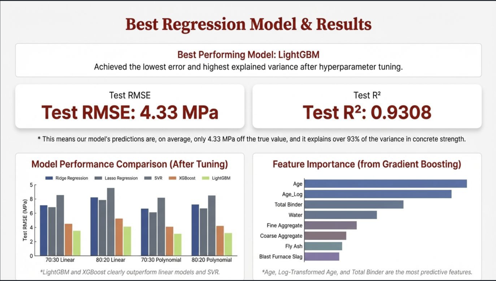
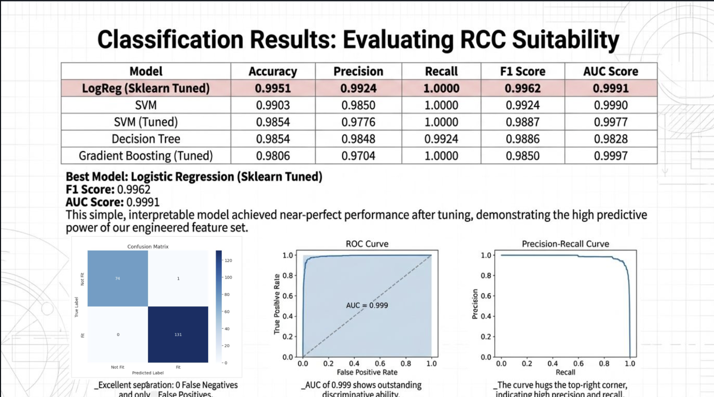

# Predicting Compressive Strength of Concrete using Machine Learning

This project focuses on predicting the **compressive strength of concrete** based on its mix composition and curing age, and determining whether a given concrete mix is suitable for use in **Reinforced Cement Concrete (RCC)** as per **Indian Standard IS 456:2000**.

The project is implemented as part of **AIL7024 – Machine Learning**, following a two-stage modelling approach involving **regression** and **classification**.

---

## Dataset

- **Name:** Concrete Compressive Strength Dataset  
- **Source:** UCI Machine Learning Repository  
- **Link:** https://archive.ics.uci.edu/dataset/165/concrete+compressive+strength  

The dataset contains **1030 samples** with **8 input features** related to concrete mix proportions and curing age.  
The target variable is the **compressive strength (MPa)**.

---

## Problem Formulation

### Stage I: Regression  
Predict the compressive strength of concrete using regression techniques.

### Stage II: Classification  
Classify whether a concrete sample is **fit for RCC usage** based on:
- Compressive strength ≥ 20 MPa  
- Curing age ≥ 28 days  

---

## Methodology

### Data Preprocessing
- Data loading and validation
- Exploratory data analysis
- Feature engineering
- Train–test splits and cross-validation

### Regression Models
- Linear Regression (from scratch)
- Polynomial Regression
- Ridge and Lasso Regression
- Support Vector Regression (SVR)
- Gradient Boosting (XGBoost, LightGBM)

**Evaluation Metrics:**
- Mean Squared Error (MSE)
- Root Mean Squared Error (RMSE)
- R² Score

---

### Classification Models
- Logistic Regression (from scratch)
- Ridge and Lasso Regularized Logistic Regression
- Decision Trees
- Random Forest
- Support Vector Machine (SVM)
- Gradient Boosting Classifiers

**Evaluation Metrics:**
- Accuracy
- Precision
- Recall
- F1-Score
- ROC-AUC

Class imbalance handling techniques were applied where necessary.

---

## Tools and Technologies

- **Programming Language:** Python  
- **Libraries:** NumPy, Pandas, Scikit-learn, Matplotlib, Seaborn  
- **Advanced Models:** XGBoost, LightGBM  
- **Environment:** Google Colab / Local Python Environment  

---

## Results Summary

### Regression Performance

- Multiple regression models were evaluated, including linear models, SVR, XGBoost, and LightGBM.
- **LightGBM** emerged as the best-performing regression model after hyperparameter tuning.
- Achieved a **Test RMSE of 4.42 MPa** and **Test R² of 0.9278**, indicating strong predictive accuracy and high explained variance.
- Tree-based ensemble models consistently outperformed linear and kernel-based methods, especially when combined with domain-driven feature engineering.

### Classification Performance

- Concrete mixes were classified for RCC suitability based on **IS 456:2000** criteria.
- Several classifiers were evaluated, including Logistic Regression, SVM, Decision Trees, and Gradient Boosting.
- A **tuned Logistic Regression model** achieved the best overall performance with:
  - **F1-score ≈ 0.996**
  - **ROC-AUC ≈ 0.999**

Detailed numerical results, comparison tables, and performance plots are available in the `reports/` directory and in the notebook.

---

## Contributions

This was a **team project**, and contributions are clearly divided as follows:

### Rohit Kumar  
**Entry Number:** 2025AIB2565  

**Contributions:**
- Data preprocessing and exploratory data analysis
- Feature engineering
- Implementation and evaluation of regression models
- Hyperparameter tuning and regression result analysis

### Akhil Vashistha  
**Entry Number:** 2025AIB2558 

**Contributions:**
- Design and implementation of classification models
- Handling class imbalance
- Classification evaluation and analysis
- RCC suitability modelling

### Joint Contributions
- Problem formulation
- Model comparison
- Final report preparation

---

## Conclusion

This project demonstrates a complete machine learning workflow, from data preprocessing to advanced modelling and evaluation, applied to a real-world civil engineering problem. The results show that machine learning techniques can effectively assist in predicting concrete compressive strength and ensuring compliance with structural standards.